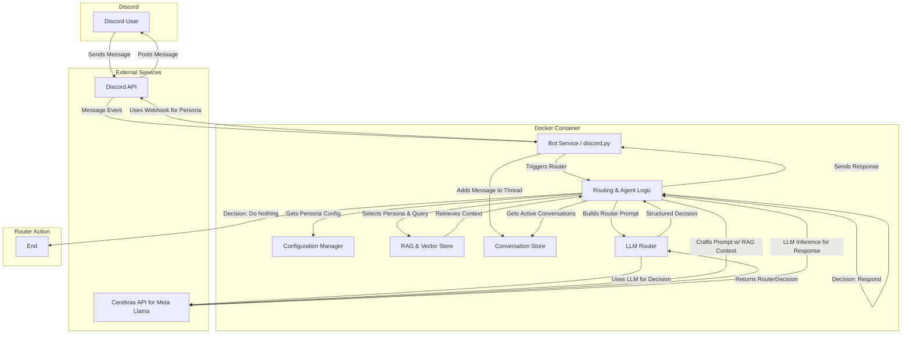

## **Architecture Document: The AI Team Bot**

### 1. Executive Summary

The **AI Team Bot** is a multi-persona AI agent for Discord designed to assist software development teams. It leverages Retrieval-Augmented Generation (RAG) to provide contextually relevant answers from a project-specific knowledge base. The system features distinct AI "personas" (e.g., Project Manager, Lead Architect) that can be directly mentioned for targeted queries.

The bot's core innovation is its **LLM-based Router**, which analyzes every message to understand conversational context, thread discussions, and determine if a persona should contribute, even without being directly mentioned. This structured, centralized approach enables robust and contextually-aware interactions.

This architecture prioritizes high testability and strategic use of sponsor technologies (Meta Llama, Cerebras, Docker) to deliver a powerful and polished hackathon project.

### 2. System Architecture Diagram



### 3. Core Components

#### 3.1. Discord Interface (`discord.py`)
*   **Responsibility:** Manages the connection to the Discord Gateway API, listens for `on_message` events, and sends responses.
*   **Persona Impersonation:** To give each persona a unique name and avatar, this component will manage **Discord Webhooks**.
    *   On first use in a channel, a webhook is created. The webhook URL is stored persistently (e.g., a `webhooks.json` file mapping `channel_id` to `webhook_url`) to avoid re-creation and rate-limiting.
    *   The bot requires the `MANAGE_WEBHOOKS` permission in the server.

#### 3.2. Agent & Routing Logic
*   **Responsibility:** The application's central controller. It orchestrates the routing and response generation process for every message.
*   **Workflow:**
    1.  On receiving a message, it is first added to the appropriate conversation thread in the **Conversation Store**.
    2.  The **LLM Router** is invoked with the context of all active conversations.
    3.  The router returns a `RouterDecision` object, which specifies whether to respond, which persona should respond, and what historical context is relevant.
    4.  If a response is warranted, the corresponding agent is activated, using the context provided by the router to generate a relevant reply.

#### 3.3. Agent Core (`pydantic-ai`)
*   **Responsibility:** Defines the structure and behavior of individual AI agents.
*   **Implementation:** A central `AIAgent` class will be initialized with a `pydantic-ai` `Agent` instance (configured for the Cerebras model), a system prompt from the persona's configuration, and a RAG tool for knowledge retrieval.

#### 3.4. RAG System (Vector Store)
*   **Responsibility:** Ingests text documents, creates vector embeddings, and retrieves relevant text chunks based on a query.
*   **Implementation:** For hackathon speed, an in-memory vector store (e.g., FAISS) or a simple file-based database (e.g., ChromaDB) will be used. Each persona will have an isolated RAG index to ensure domain-specific knowledge retrieval.

#### 3.5. LLM Router & Conversation Store
*   **Responsibility:** This is the brain of the bot, responsible for all context-aware decision-making.
*   **Conversation Store:** An in-memory store that holds `ConversationThread` objects. Each thread contains a list of messages, a timestamp, and other metadata. This provides a structured history of all recent discussions.
*   **LLM Router:**
    *   **Trigger:** The router runs on *every* message to ensure the conversation state is always current.
    *   **Process:** It constructs a detailed prompt for the Cerebras LLM, containing the new message, the list of available personas, and the message history from active conversation threads.
    *   **Structured Output:** The router's primary goal is to return a Pydantic `RouterDecision` object. This structured format dictates the bot's next action, ensuring reliable and predictable behavior. It specifies the conversation thread, whether to respond, which persona to use, and which previous messages to use as context.

#### 3.6. Configuration Management
*   **Responsibility:** Externalizes all configuration.
*   **Implementation:** A `personas.json` file will define the AI team members.
    ```json
    [
      {
        "name": "JohnPM",
        "role": "Project Manager",
        "system_prompt": "You are John, the Project Manager...",
        "knowledge_base_path": "./kbs/project_management.txt"
      },
      {
        "name": "DaveArch",
        "role": "Lead Architect",
        "system_prompt": "You are Dave, the Lead Architect...",
        "knowledge_base_path": "./kbs/architecture_docs.md"
      }
    ]
    ```

#### 3.7. Deployment (`Dockerfile`)
*   **Responsibility:** Packages the application and its dependencies into a portable container.
*   **Structure:** Standard Python container setup including dependency installation, code copying, environment variable configuration (`DISCORD_TOKEN`, `CEREBRAS_API_KEY`), and setting the `CMD` to run the bot.

### 4. Data Models (Pydantic)

Structured, validated output from the LLM Router is key to the system's reliability.

```python
from pydantic import BaseModel, Field
from typing import Optional, List

class RouterDecision(BaseModel):
    """
    The structured decision made by the LLM router, determining how the bot
    should act on an incoming message.
    """
    conversation_id: Optional[str] = Field(description="The ID of the conversation this message belongs to. If null, a new conversation should be created.")
    should_respond: bool = Field(description="Whether the bot should generate and send a response to this message.")
    confidence: float = Field(description="The router's confidence in its decision (from 0.0 to 1.0).")
    persona_name: Optional[str] = Field(description="The name of the persona that should respond (if should_respond is true).")
    context_messages: Optional[List[str]] = Field(description="A list of message IDs from the conversation history that are relevant for generating the response.")

class ConversationThread(BaseModel):
    """
    Represents a single, stateful conversation thread, containing a history
    of messages.
    """
    id: str
    messages: List[dict] # Simplified for diagram, would be ConversationMessage objects
    last_updated: float
```

### 5. Implementation & Testing

#### Core Components
1. **RAG Engine**: Standalone AI agent with knowledge base retrieval
2. **Discord Integration**: Bot with mention detection and response handling
3. **Multi-Persona System**: Distinct personas with specialized knowledge bases
4. **LLM Router**: Intelligent conversation routing and context management
5. **Conversation Store**: Thread tracking and message history

#### Testing Strategy
- **Unit Tests**: Use pytest to test individual components (router logic, agent responses, conversation management)
- **Integration Tests**: Test Discord bot functionality with mock servers
- **End-to-End Tests**: Verify complete conversation flows in Discord environment
- **Performance Tests**: Ensure router responses are fast and accurate